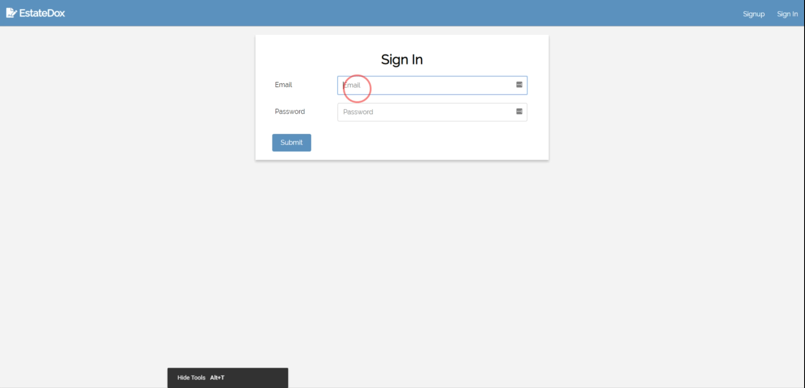
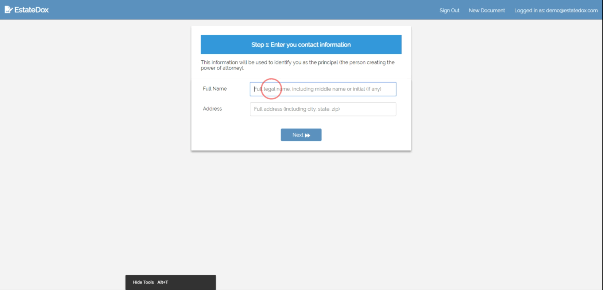
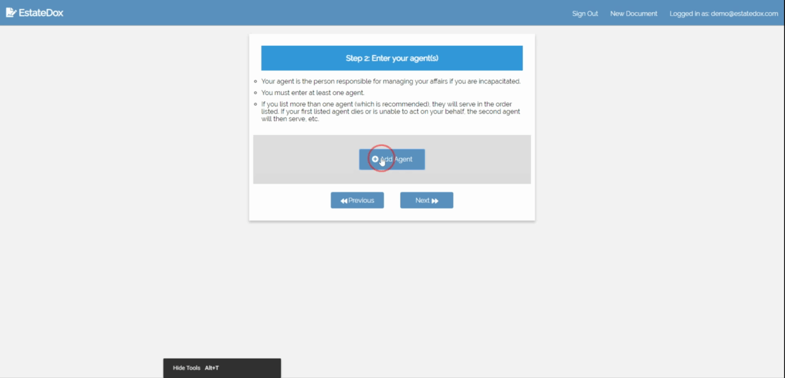

# EstateDox - [https://estatedox.netlify.com]](https://estatedox.netlify.com)

A web-based application that lets you create a durable power of attorney by completing a simple wizard. Simply fill in the
relevant information, and you will be able to create and download a Microsoft Word version of the completed document.

Login
=====

Enter your information
==================================

* Enter your name and address to be used to complete your document.
  

Enter your agents
==================================

* Your agent is the person responsible for managing your affairs if you are incapacitated.
* You must enter at least one agent.
* If you list more than one agent (which is recommended), they will serve in the order listed. If your first listed agent dies or is unable to act on your behalf, the second agent will then serve, etc.

  
  

Select when your document should become effective and submit the form. That's it!
================

*  If you select "Effective only upon my disability", your agent(s) will not be able to act on your behalf until your doctor has determined that you are unable to manage your own affairs.

* If you select "Effective Immediately", your agent will be able to act on your behalf as soon as you sign the document, and the document will remain in effect during any subsequent disability.
